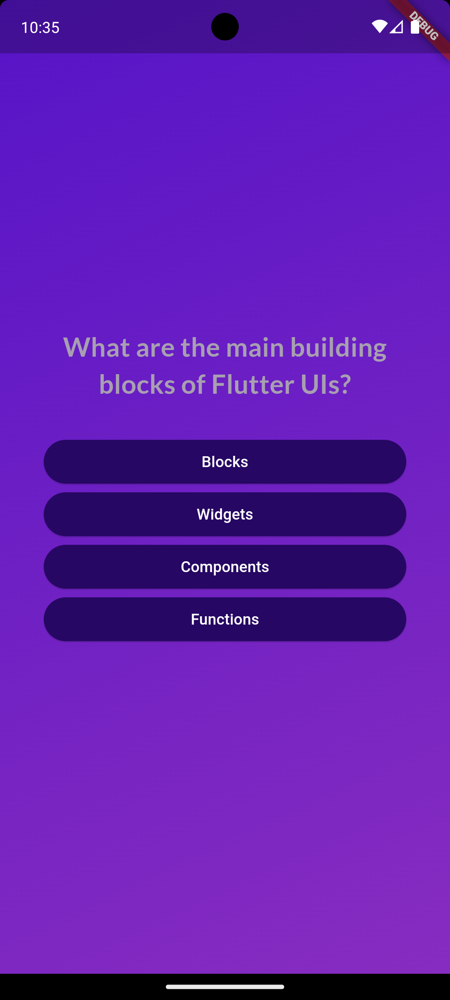
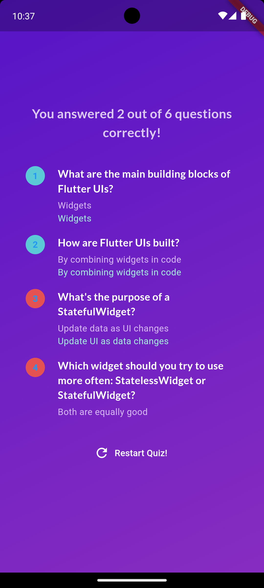
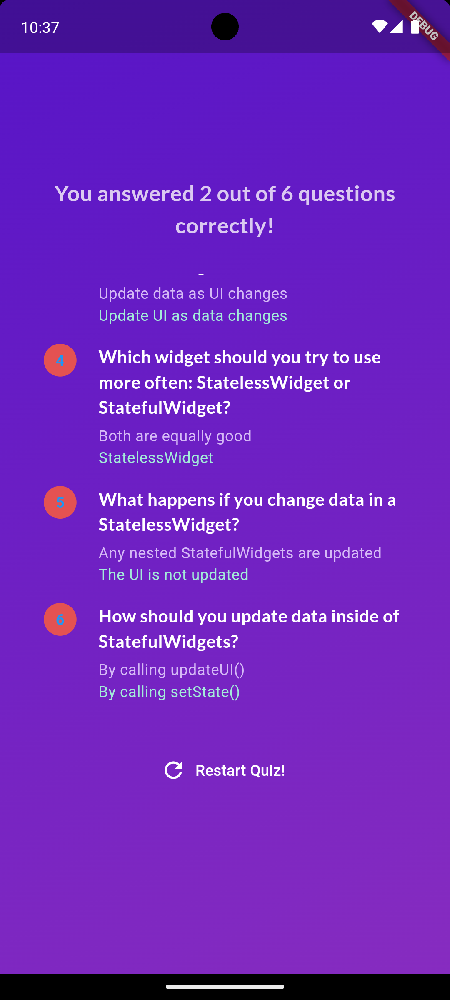

# Quiz app

## Table of Contents
- [Introduction](#introduction)
- [Features](#features)
- [Technologies Used](#technologies-used)
- [Setup Instructions](#setup-instructions)
- [Usage](#usage)
- [Screenshots](#screenshots)
- [Credits](#credits)
- [Contact](#contact)

## Introduction
A simple Flutter project that provides a question and answer interface in the form of a quiz and shows the result at the end. Project was made as a part of course while learning.

## Features
- **Enter question and answers:** Questions and answers need to be added in the code itself. While entering the options, the answer option needs to be the first option always as it has been coded to take the first option as the answer. Although before displaying the options to the user, the options are shuffled and thus the quiz is fair.
- **Display questions and options:** Displays the questions and options and allows users to choose one of the options as their answer choice.
- **Display results:** Displays the results at the end with the number of correctly answered questions out of total questions. Also shows the user's choice along with th ecorrect answer.
- **Restart quiz:** The quiz can be taken again using the 'Restart Quiz' button.

## Technologies Used
- **Flutter:** Framework and its various packages.
- **Dart:** Primary programming language.

## Setup Instructions
1. **Install Flutter and Android Studio:**
    
    Make sure you have the necessary requirements to run a Flutter app on your local machine. Flutter framework, its extensions in VS Code, Android Studio, android emulator (from Android Studio) to run your apps and see them how they look on screens (Alternatively, you can run apps on your actual mobile devices too).

2. **Clone the repository:**
   Type the following commands in your terminal after you have directed it to a particular directory.
   
   - git clone https://github.com/amaanshaikh2114/Quiz_app.git
    

## Usage
1. **Run the application:**
    Go to the directory where you have placed the project and type 'flutter run' in the terminal. Ensure flutter is recognized by your system by making sure it's in the 'Path' option of System variables by going to the environment variables of your system.
    

2. **Start quiz:**
    Use the 'Start quiz' button to start the quiz.

3. **Select answer:**
    Select an option as your answer for all questions.

4. **View result:**
    View final results and your and corresponding correct answer. 

## Screenshots

  <figure>
    <figcaption align="center">Start page</figcaption>
    
  </figure>
  
  <figure>
    <figcaption align="center">Questions Page</figcaption>
    
  </figure>

  <figure>
    <figcaption align="center">Results Page 1</figcaption>
    
  </figure>

  <figure>
    <figcaption align="center">Results Page 2</figcaption>
    
  </figure>

## Credits
'Flutter & Dart - The Complete Guide [2024 Edition]' Course by Maximilian Schwarzmüller on Udemy.

## Contact
For any questions or inquiries, please contact [Amaan Shaikh](mailto:amaanmazhar211@gmail.com). Send a mail to amaanmazhar211@gmail.com

